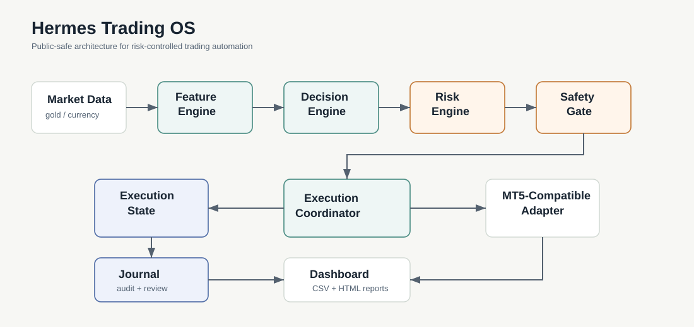

# Hermes Trading OS

**A personal systems-engineering case study for risk-controlled trading automation across gold and currency-market workflows.**

Hermes Trading OS documents the operating model behind a modular trading automation system: signal intake, risk governance, execution coordination, state recovery, journaling, and operational monitoring. The repository is public-safe by design: it shows the system structure, decision process, SOPs, mock events, and representative interfaces without publishing proprietary strategy rules or private infrastructure details.

> Status: Active controlled forward-testing. Accuracy and expectancy metrics will be published only after the first 100 fully journaled trades.



## What This Shows

| Area | Evidence in this repository |
| --- | --- |
| System design | Architecture map, event flow, state machine, failure recovery model |
| Risk governance | Pre-execution guardrails, fail-closed rules, review thresholds |
| Execution discipline | Exactly-once design, idempotency, broker-adapter abstraction |
| Observability | SQLite-style journal schema, audit events, dashboard wireframe |
| Delivery quality | PRD, UAT plan, test strategy, roadmap, incident response SOP |
| Documentation depth | ADRs, traceability matrix, operating principles, sanitized examples |

## Repository Map

```text
hermes-trading-os/
├── README.md
├── PORTFOLIO_NOTICE.md
├── SECURITY.md
├── LICENSE
├── docs/
│   ├── 01-case-study.md
│   ├── 02-prd.md
│   ├── 03-personas.md
│   ├── 04-system-architecture.md
│   ├── 05-execution-lifecycle.md
│   ├── 06-risk-governance.md
│   ├── 07-observability-and-journaling.md
│   ├── 08-test-strategy.md
│   ├── 09-uat-plan.md
│   ├── 10-accuracy-measurement.md
│   ├── 11-roadmap.md
│   ├── 12-incident-response.md
│   └── adr/
├── assets/
│   ├── diagrams/
│   └── screenshots/
├── examples/
│   └── sanitized-events/
└── src/
    └── illustrative/
```

## Operating Principles

- **Fail closed before execution.** Uncertain, incomplete, stale, or invalid decisions do not progress.
- **One event, one execution decision.** Signal IDs are deterministic and used for idempotency.
- **Risk is a system boundary.** The risk layer is separate from signal generation and execution.
- **Current-bar bias is not allowed.** Decisions are designed around closed-bar data and auditable inputs.
- **Observability is part of the product.** Every accepted, rejected, blocked, and executed decision must become reviewable data.
- **Performance claims require sample size.** Public accuracy reporting waits for 100 completed journal records.

## High-Level Flow

```text
Market Data
  -> Feature Engine
  -> Decision Event
  -> Signal Normalizer
  -> Risk Engine
  -> Safety Gate
  -> Execution Coordinator
  -> MT5-Compatible Adapter
  -> Journal + Dashboard
```

The public repository intentionally omits exact thresholds, signal formulas, broker-specific symbols, credentials, live tickets, infrastructure paths, and account information.

## Current Forward-Test Reporting Policy

Hermes is in controlled forward-testing. The public reporting policy is deliberately conservative:

- No accuracy claim before 100 fully journaled trades.
- No expectancy claim before closed-trade review.
- No strategy-specific performance table in the public repository.
- Engineering validation is reported separately from trading performance.
- Skipped, rejected, and blocked signals remain part of system quality review.

See [Accuracy Measurement](docs/10-accuracy-measurement.md) for the measurement plan.

## Representative Validation Coverage

The private implementation is validated around the following core scenarios. This public repository includes the test strategy and mock artifacts, not the proprietary implementation.

| Category | Representative scenarios |
| --- | --- |
| Idempotency | Duplicate signal blocked, exactly-once execution state |
| Risk | Invalid risk rejected, minimum-size constraints handled |
| Safety | Unsupported symbol blocked, open-position conflict blocked |
| Execution | Broker rejection persisted, lost response reconciled |
| Journaling | Execution row creation, broker ticket preservation, MFE/MAE tracking |
| Reporting | CSV export and static dashboard generation |

## Public Example Artifacts

- [Mock signal event](examples/sanitized-events/mock-signal-event.json)
- [Mock risk decision](examples/sanitized-events/mock-risk-decision.json)
- [Mock execution state](examples/sanitized-events/mock-execution-state.json)
- [Mock journal row](examples/sanitized-events/mock-journal-row.json)
- [Dashboard wireframe](assets/screenshots/dashboard-wireframe.svg)

## Documentation Index

| Document | Purpose |
| --- | --- |
| [Case Study](docs/01-case-study.md) | Narrative of the system, constraints, and outcomes |
| [PRD](docs/02-prd.md) | Product requirements and non-goals |
| [Personas](docs/03-personas.md) | Stakeholders and operating needs |
| [Architecture](docs/04-system-architecture.md) | Component model and data flow |
| [Execution Lifecycle](docs/05-execution-lifecycle.md) | State transitions and failure paths |
| [Risk Governance](docs/06-risk-governance.md) | Guardrails, policy, and escalation model |
| [Observability](docs/07-observability-and-journaling.md) | Journal, audit, and dashboard design |
| [Test Strategy](docs/08-test-strategy.md) | Validation approach and coverage |
| [UAT Plan](docs/09-uat-plan.md) | Acceptance checks before operational changes |
| [Accuracy Measurement](docs/10-accuracy-measurement.md) | 100-trade performance review plan |
| [Roadmap](docs/11-roadmap.md) | Planned improvements and sequencing |
| [Incident Response](docs/12-incident-response.md) | Operational response playbooks |
| [Personal Operating SOP](docs/13-personal-operating-sop.md) | Day-to-day governance checklist |
| [Engineering Scorecard](docs/14-engineering-scorecard.md) | Maturity model and current status |
| [Traceability Matrix](docs/traceability-matrix.md) | Requirements mapped to validation |

## Notice

This is a sanitized public case study. Proprietary decision logic, strategy thresholds, credentials, broker account details, private infrastructure, and operational execution parameters are intentionally excluded.
