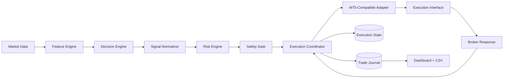

# System Architecture

## Architecture Principle

Hermes separates decision generation, risk review, execution coordination, and observation. A signal event cannot directly place an order. It must pass through deterministic validation and state tracking first.

## Component Model

## Layers

| Layer | Responsibility | Must not do |
| --- | --- | --- |
| Market data | Provide closed-bar and current-position context | Execute trades |
| Feature engine | Compute deterministic features | Access credentials |
| Decision engine | Produce candidate events | Override risk policy |
| Signal normalizer | Standardize event payload and ID | Submit orders |
| Risk engine | Validate risk eligibility | Generate strategy |
| Safety gate | Validate operational constraints | Widen risk |
| Execution coordinator | Manage state, idempotency, submission, reconciliation | Retry uncertain executions blindly |
| Adapter | Translate requests to execution interface | Decide strategy |
| Journal | Persist decisions and outcomes | Modify positions |
| Dashboard | Display system state | Become source of truth |

## MT5-Compatible Boundary

The public architecture describes an MT5-compatible adapter interface because that is a recognizable execution environment in the trading domain. The repository does not include account details, broker identifiers, production endpoints, or exact operational deployment paths.

## Data Flow

1. Market data is transformed into features.
2. Decision engine emits a candidate signal.
3. Signal normalizer assigns deterministic identity.
4. Risk engine validates risk eligibility.
5. Safety gate validates operational constraints.
6. Execution coordinator persists state before submission.
7. Adapter submits through the execution interface.
8. Broker response is confirmed, rejected, or reconciled.
9. Journal and dashboard are updated for review.

## Design Constraints

- Decisions use closed-bar inputs.
- Unknown states fail closed.
- Execution identity is persistent.
- Journal is the review source.
- Public documentation excludes the private strategy edge.

