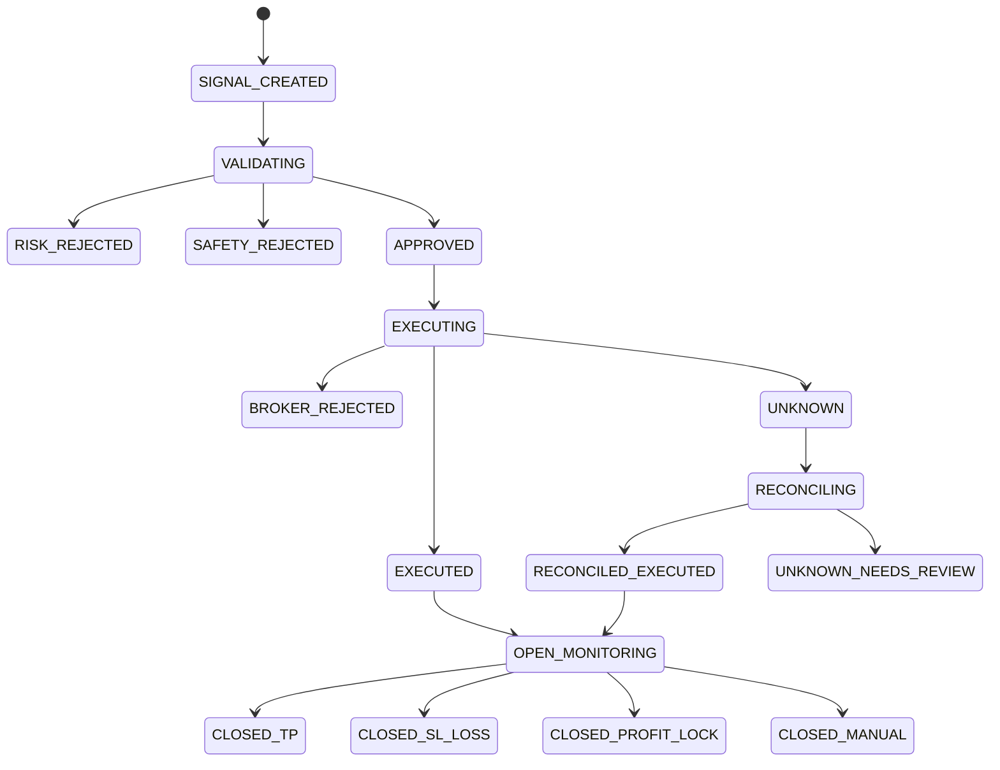

# Execution Lifecycle

## State Machine



## State Definitions

| State | Meaning |
| --- | --- |
| `SIGNAL_CREATED` | Candidate decision event exists |
| `VALIDATING` | Risk and safety checks are running |
| `RISK_REJECTED` | Event failed risk policy |
| `SAFETY_REJECTED` | Event failed operational safety policy |
| `APPROVED` | Event can be submitted |
| `EXECUTING` | State persisted before broker submission |
| `EXECUTED` | Broker confirmed acceptance |
| `BROKER_REJECTED` | Broker explicitly rejected request |
| `UNKNOWN` | Submission uncertainty exists |
| `RECONCILING` | System checks positions/deals before any retry |
| `RECONCILED_EXECUTED` | Trade was found after an uncertain response |
| `UNKNOWN_NEEDS_REVIEW` | Human review required; no automatic retry |
| `OPEN_MONITORING` | Trade is open and excursion is tracked |
| `CLOSED_TP` | Trade closed at intended profit target |
| `CLOSED_SL_LOSS` | Trade closed at original protective stop with loss |
| `CLOSED_PROFIT_LOCK` | Trade closed by a moved protective stop in profit |
| `CLOSED_MANUAL` | Trade closed manually or by external intervention |

## Exactly-Once Execution Rule

Every eligible event receives a deterministic `signal_id`. Before submission, the coordinator checks persistent state. If the event already exists, the system does not submit again.

The critical pattern:

```text
create EXECUTING state
submit once
record broker response
reconcile if uncertain
never auto-retry uncertain state
```

## Why This Matters

The most dangerous automation bugs are often not strategy bugs. They are state bugs:

- repeated command runs
- network failure after broker acceptance
- stale local process state
- duplicate events from the same market bar

Hermes treats execution state as a first-class product requirement.

