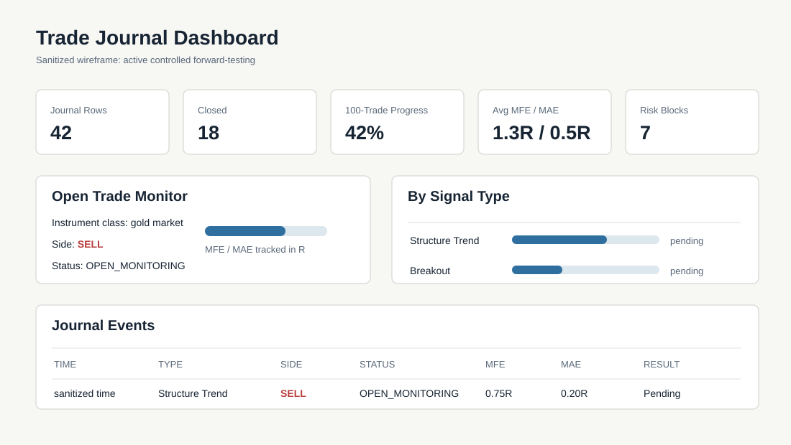

# Observability and Journaling

## Purpose

Hermes treats observability as part of the trading system, not an afterthought. Every decision should be explainable after the fact.

## Journal Goals

- Record signal identity and context.
- Separate accepted, rejected, blocked, and executed outcomes.
- Track open-trade high and low.
- Store final result and exit reason.
- Preserve broker reference IDs in private implementation.
- Export dashboard-ready CSV/HTML reports.

## Public Journal Schema

| Column | Purpose |
| --- | --- |
| `signal_id` | Deterministic event identity |
| `created_at` | Journal creation time |
| `timestamp` | Market event timestamp |
| `instrument_class` | Sanitized market category |
| `timeframe` | Event timeframe |
| `side` | Buy or sell |
| `signal_type` | Sanitized setup category |
| `confidence` | Optional model or rule confidence |
| `entry` | Sanitized entry value |
| `sl` | Sanitized protective stop |
| `tp` | Sanitized target |
| `risk_unit` | Normalized risk distance |
| `status` | Current lifecycle status |
| `final_result` | TP, SL loss, profit lock, breakeven, manual close |
| `mfe_r` | Max favorable excursion in R |
| `mae_r` | Max adverse excursion in R |
| `highest_price_during_trade` | Highest observed price while open |
| `lowest_price_during_trade` | Lowest observed price while open |
| `notes` | Review notes |

## Dashboard Concept

Dashboard sections:

- open decisions
- closed outcomes
- signal-type summary
- MFE/MAE review
- risk rejection count
- incident/reconciliation count
- 100-trade sample progress

## Audit Event Example

See [mock audit event](../examples/sanitized-events/mock-audit-event.json).

## Review Questions

After each closed trade, the journal should support:

- Did the trade reach meaningful favorable excursion before exit?
- Did the exit reason reflect actual behavior?
- Did the signal type show repeatable behavior?
- Was risk policy followed?
- Was the system state clean?
- Was manual intervention involved?

